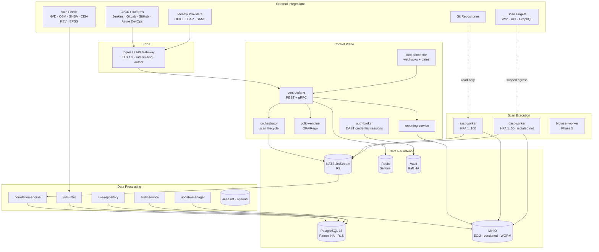
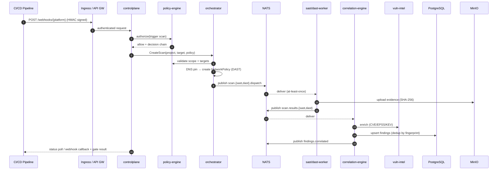
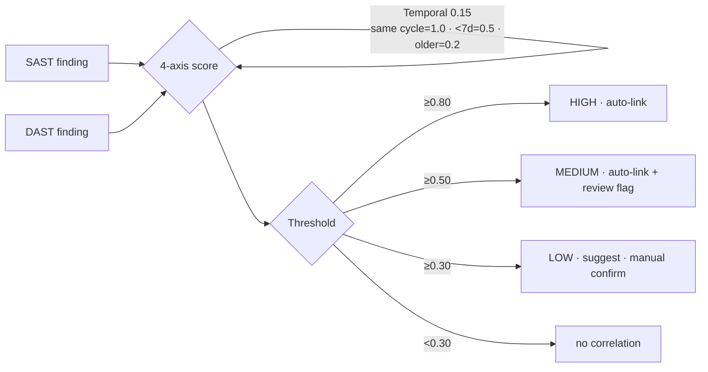
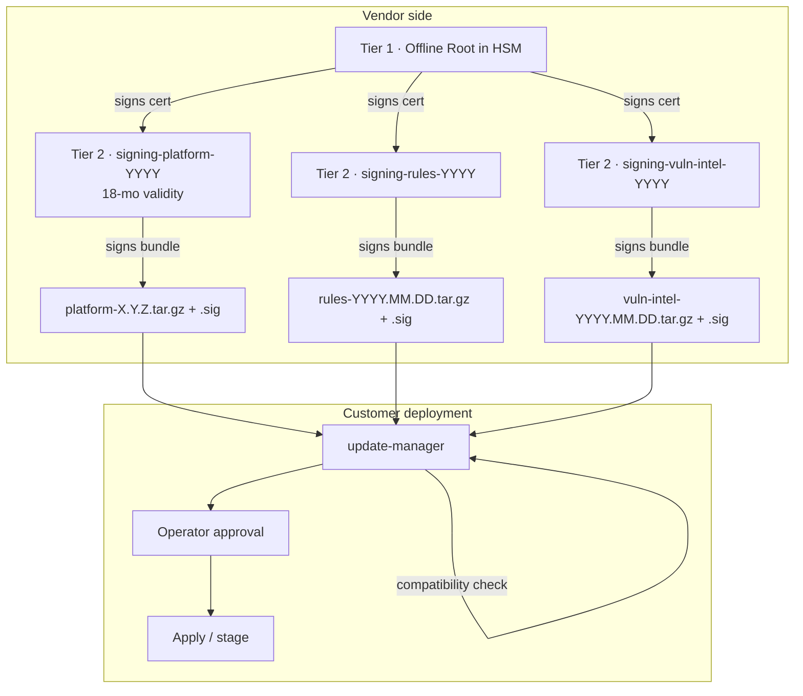
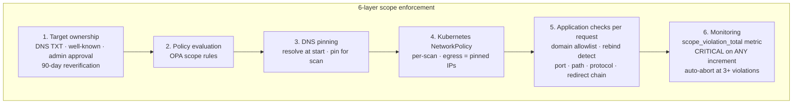

# SentinelCore — Consolidated Architecture

**Version:** 1.2.0-DRAFT
**Classification:** INTERNAL — ARCHITECTURE
**Last updated:** 2026-04-17
**Scope:** Authoritative single-page architecture for the SentinelCore security platform. Condenses the full set of chapters under `docs/architecture/`, `docs/security/`, `docs/data-model/`, `docs/deployment/`, `docs/operations/`, and the phase plans. Detailed chapters remain the source of truth for deep dives; this file is the entry point.

---

## 1. Executive Summary

SentinelCore is a **customer-managed application security platform** that unifies **SAST**, **DAST**, and **vulnerability intelligence** into one correlated finding pipeline. It is built for regulated and air-gapped environments: every feature works offline; online connectivity is an optimisation.

Key properties:

- **16 core services** across four tiers (control plane, data processing, scan execution, data persistence).
- **Go + Python**, PostgreSQL 16, MinIO, NATS JetStream, Redis, HashiCorp Vault.
- **Kubernetes-first** with Helm; Docker Compose for evaluation; k3s for small-team deployments.
- **Air-gap-first**: Ed25519-signed bundles for platform, rules and vulnerability intelligence.
- **Zero-trust internal plane**: mTLS everywhere, OPA/Rego authorization, PostgreSQL row-level security.
- **Tamper-evident audit** with HMAC-SHA256 chain and hourly integrity verification.
- **Multi-layer DAST scope enforcement** (ownership → policy → DNS pin → NetworkPolicy → per-request checks → telemetry) to prevent scope escape and SSRF.
- **Immutable findings** with content-addressed evidence in MinIO (SHA-256 + optional WORM).

Target SLAs: **99.9% availability**, **RPO < 1h**, **RTO < 4h**, API read p95 < 200 ms, SAST throughput ≥ 50k LOC/min/worker.

---

## 2. Design Principles

| Principle | Concrete manifestation |
|---|---|
| Customer-managed only | No hosted mode, no telemetry phoning home, no non-customer egress in any supported deployment. |
| Air-gap is primary | Offline bundles, internal CA, embedded observability; connectivity is optional. |
| Defense-in-depth | Scope: 6 enforcement layers. Auth: app + RLS. Supply chain: 3-tier key hierarchy + compatibility gate + operator approval. |
| Immutable evidence | Findings are append-only (trigger-enforced); evidence is hashed + versioned + optionally WORM-locked. |
| Policy-as-code | OPA/Rego for RBAC, scan scope, CI/CD gates, retention; decision chain returned for every deny. |
| Least privilege | Per-service K8s ServiceAccounts, per-service DB users, per-scan NetworkPolicies, seccomp + read-only rootfs for workers. |
| Stateless control plane, stateful data plane | Horizontal scale on workers and control plane; HA via Patroni (DB), Raft (NATS, Vault), erasure coding (MinIO). |

---

## 3. High-Level Architecture



The platform is organised into five logical tiers:

1. **External integrations** – CI/CD, SCM, IdPs, vulnerability feeds, scan targets. All cross trust boundaries.
2. **Edge** – Ingress/API gateway terminates TLS, enforces rate limits and runs first-pass authentication.
3. **Control plane** – stateless request handlers and the scan lifecycle orchestrator.
4. **Data processing** – asynchronous consumers of scan results and feeds; all writes to persistent state.
5. **Scan execution** – ephemeral, sandboxed workers for SAST and DAST (and, in Phase 5, browser-based DAST).
6. **Data persistence** – stateful storage backends (Postgres, MinIO, NATS, Redis, Vault).

---

## 4. Service Catalog

All internal gRPC listeners are mTLS-only. External REST is TLS 1.3 with OAuth2 / OIDC / API keys.

### 4.1 Control plane

| Service | Lang | Ports | Responsibility | HA |
|---|---|---|---|---|
| `controlplane` | Go | 8080 REST, 9000 gRPC | API gateway: projects, scans, findings, policies, reports, admin. Delegates authZ to policy-engine. Emits state-change events to NATS. | 2+ active/active |
| `orchestrator` | Go | 9001 gRPC | Scan lifecycle FSM: `PENDING → SCOPE_VALIDATING → DISPATCHED → RUNNING → COLLECTING → CORRELATING → COMPLETED`. Creates per-scan NetworkPolicies. Cron scheduling. | leader-elected (2, <15 s failover) |
| `policy-engine` | Go (embeds OPA) | 9006 gRPC | RBAC, scan scope, CI/CD gates, retention, allowlist evaluation. Returns decision chain. | 2+ active/active |
| `auth-broker` | Go | 9002 gRPC | Manages DAST authentication (form, OAuth2 ClientCreds/AuthCode, API key, bearer, header, scripted). Fetches credentials from Vault per request; never caches beyond session. Proactively re-auths before expiry. | 2+ active/active |
| `cicd-connector` | Go | 8081 REST | Receives platform webhooks (GitHub HMAC-SHA256, GitLab token, Jenkins shared secret, generic HMAC), triggers scans, enforces gates, posts PR/MR comments. Ships the `sentinelcore-cli`. | 2+ active/active |
| `reporting-service` | Go + Python | 9008 gRPC | Executive, technical, compliance, trend, diff, SLA reports in PDF/HTML/JSON/SARIF/CSV. Scheduled generation. | 2 |

### 4.2 Data processing

| Service | Lang | Ports | Responsibility | HA |
|---|---|---|---|---|
| `correlation-engine` | Go | 9005 gRPC | Consumes `scan.results.*`; deduplicates via fingerprint; runs 4-axis correlation; writes correlated findings + composite risk score. | 2+ active/active |
| `vuln-intel` | Go | 9003 gRPC | Ingests NVD, OSV, GHSA, CISA KEV, EPSS (online pull 2–6 h / offline signed bundles). Normalises to unified schema. SCA matching for npm, PyPI, Maven, Go, NuGet, RubyGems, Cargo, Composer. Emits `vuln.intelligence.new` to trigger incremental rescans. | 2+ active/active |
| `rule-repository` | Go | 9004 gRPC | SAST + DAST rule storage; semantic versioning; layering custom > vendor-updated > built-in so customer overlays survive updates. | 2+ active/active |
| `update-manager` | Go | 9009 gRPC | Platform (monthly + hotfix), rules (bi-weekly), vuln intel (continuous/weekly). Ed25519 verification, compatibility check, staging, operator approval, rollback. | 1 (cluster-leader) |
| `audit-service` | Go | 9007 gRPC | Append-only HMAC-chained audit log. Hourly integrity verification. SIEM export (syslog RFC 5424 / HTTPS webhook / Kafka / encrypted JSONL). | 2+ active/active |
| `ai-assist` *(opt)* | Python | 9010 gRPC | Optional on-prem LLM for finding summaries, remediation hints. Disabled by default; never calls external APIs. | 0–2 |

### 4.3 Scan execution

| Worker | Lang | Responsibility | Isolation | Scale |
|---|---|---|---|---|
| `sast-worker` | Go + Python | Language detection → dep extraction → AST → taint analysis → pattern matching → secret detection → SCA. MVP: Java, Python, JS/TS. Phase 2: + Go, C#, Ruby, PHP, C/C++. | Non-root UID 65534, read-only rootfs, drop ALL caps, seccomp allow-list (no `execve`, `ptrace`, `mount`, `setuid`), AppArmor, no network egress, ephemeral pod. Optional gVisor (`runsc`) for high-security deployments. | HPA 1–100 |
| `dast-worker` | Go | Scope validation → discovery (crawl or OpenAPI-driven) → passive → active testing → evidence capture (full HTTP pairs, screenshots, DOM). | Scope-restricted NetworkPolicy, DNS pinning, per-request rebinding check, egress-only to pinned target IPs. | HPA 1–50 |
| `browser-worker` *(Phase 5)* | Go + Chromium | Safe crawling, non-destructive interaction, SPA route discovery, auth-variance diffing, findings derivation. | Custom seccomp + read-only rootfs + `tmpfs` for `/tmp` + shm size capped; all inputs budget-limited. | HPA 1–20 |

### 4.4 Data persistence

| System | Role | HA strategy |
|---|---|---|
| **PostgreSQL 16** | Primary relational store (orgs, teams, users, scans, findings, evidence metadata, rules, vuln intel, policies, audit partitions, reports, update state, auth configs, CI/CD state). Monthly partitioning for findings and audit. | Patroni: 1 primary + 1 sync standby, auto-failover <30 s. PgBouncer transaction pooling. Continuous WAL to MinIO. |
| **MinIO** | Evidence (`{project_id}/{scan_id}/{sast|dast}/{finding_id}/`), report artifacts, WAL archives, backup objects. | Distributed 4+ nodes, erasure code `EC:2` (survives 2 node loss). Versioning always on; optional object-lock WORM. Daily `mc mirror` to external NFS/tape. |
| **NATS JetStream** | Event bus. Streams: `scan.sast.dispatch`, `scan.dast.dispatch`, `scan.results.{sast,dast}`, `scan.progress`, `findings.correlated`, `vuln.intelligence.new`, `audit.events`, `notifications.*`. At-least-once, idempotent consumers, default 7-day retention. | 3-node Raft, replication factor 3. |
| **Redis** | Sessions (JWT revocation list), rate-limit token buckets, short-TTL caches (project configs, policies). | 2 instances + Sentinel. AOF + RDB on encrypted volume. |
| **HashiCorp Vault** | DAST credentials, DB passwords, TLS private keys, HMAC keys (versioned, never deleted), signing keys. | 3-node Raft. Shamir 3-of-5 unseal. Optional auto-unseal via AWS/Azure/GCP KMS (cloud deployments only). |

---

## 5. Request & Data Flows

### 5.1 CI/CD-triggered scan (end-to-end)



### 5.2 Finding correlation (SAST × DAST)

Correlation is a **weighted-sum across four axes**, computed whenever a SAST and DAST finding share project and scan cycle:



**Dedup fingerprint:** `SHA-256(project_id || finding_type || cwe_id || file_path || line_start || url || parameter || dependency_name || cve_id)`.

**Composite risk score:** `CVSS_base × exploit_multiplier × asset_criticality`, capped at 10.0, where `exploit_multiplier ∈ {no=1.0, PoC=1.3, actively_exploited=1.6}` and `asset_criticality ∈ {critical=1.4, high=1.2, medium=1.0, low=0.8}`.

### 5.3 Update supply chain



Platform updates **require** operator approval; rule and vuln-intel updates auto-apply after verification. Rollback combines DB snapshot + Helm rollback + retained image tags.

---

## 6. Data Model (overview)

**Entity hierarchy:**

```
Organization 1──N Teams 1──N Projects 1──N ScanTargets
                 │              │
                 N              N
          TeamMemberships  ScanJobs 1──N Findings
                               │          │
                            Evidence  StateTransitions
                            (MinIO)   Annotations
```

**Core tables (selected):**

- `projects` — org/team-scoped; `asset_criticality` (critical/high/medium/low), `scan_config` JSONB, soft-delete.
- `scan_targets` — types `web_app | api | graphql`; `allowed_domains/paths/ports`, `excluded_paths`, `max_rps`, `auth_config_id`. Ownership verified via DNS TXT (`_sentinelcore-verify.<domain> "sc-verify=<token>"`), HTTP well-known (`/.well-known/sentinelcore-verify`), or admin approval; reverified every 90 days.
- `scan_jobs` — FSM states, `trigger_source` JSONB, `worker_id`, `progress {phase,percent}`, `timeout_seconds`, `retry_count`.
- `findings` — **immutable** trigger-enforced: `title, description, cwe_id, severity, confidence, file_path, line_*, code_snippet, url, http_method, parameter, dependency_name, dependency_version, cve_ids, evidence_ref, evidence_hash, fingerprint, finding_type, first_seen, rule_id` cannot be updated. Mutable: `status, last_seen, scan_count, correlated_finding_ids, risk_score, tags, evidence_integrity`.
- `findings_state_transitions` — immutable audit of status changes.
- `vulnerabilities` — CVE unique key, CVSS v3.1 vector+score, EPSS + percentile, CWE IDs, exploit availability, active-exploitation flag, sources, references, raw feed JSONB.
- `package_vulnerabilities` — `(ecosystem, package_name, version_range, fixed_version, cve_id)`.
- `audit_log` — BIGSERIAL PK, RANGE-partitioned monthly; `(event_id, timestamp, actor_*, action, resource_*, context, details, result, previous_hash, entry_hash, hmac_key_version)`.

**Finding enums:**

- `finding_type ∈ {sast, dast, sca, secret}`
- `severity ∈ {critical, high, medium, low, info}`
- `confidence ∈ {high, medium, low}`
- `status ∈ {new, confirmed, in_progress, mitigated, resolved, reopened, accepted_risk, false_positive}`

**Row-Level Security:** all findings/scans/projects tables carry RLS policies keyed on session vars `app.current_user_id`, `app.current_org_id`; global roles (`platform_admin`, `security_director`, `auditor`) bypass team-scope checks. Enforcement is independent of application logic — a bug in the API cannot leak cross-team data.

**Retention:**

| Data | Default | Minimum | Mechanism |
|---|---|---|---|
| Findings + scans | 2 y | Configurable | Partition drop + archive |
| Evidence | 1 y | Configurable | Lifecycle policy on MinIO |
| Audit log | 7 y | **1 y** | Monthly partitions, cold-archive |
| Reports | 2 y | Configurable | Automated |
| Vuln intel | Indefinite | — | Updated in place |

---

## 7. Security Architecture

### 7.1 Trust boundaries

| Zone | Trust | Members |
|---|---|---|
| External | Untrusted | CI/CD, DAST targets, vuln feeds, source code (malicious), user browsers |
| Scan sandbox | Semi-trusted (isolated) | sast-worker, dast-worker, browser-worker |
| Control plane | Trusted | controlplane, orchestrator, policy-engine, correlation-engine |
| Data | Highly trusted | PostgreSQL, MinIO, Vault, HMAC/encryption keys |

All internal hops are mTLS; cert-manager rotates short-lived certs (24 h default).

### 7.2 DAST scope enforcement



**Anti-SSRF block-list (enforced at every request):** `10.0.0.0/8`, `172.16.0.0/12`, `192.168.0.0/16`, `127.0.0.0/8`, `169.254.0.0/16` (link-local incl. `169.254.169.254/32` cloud metadata), `::1/128`, `fc00::/7`, `fe80::/10`, `100.64.0.0/10` (CGNAT), `0.0.0.0/8`.

### 7.3 SAST worker sandbox

- Non-root UID 65534, read-only root FS, drop ALL capabilities.
- Seccomp allow-list only (no `execve`, `ptrace`, `mount`, `setuid`, `clone3` variants).
- AppArmor profile confines writes to the workspace.
- No network egress; workspace pulled via init container with read-only bind-mount.
- Ephemeral pod destroyed on completion. Optional gVisor (`runsc`) for the highest-assurance deployments (~15 % overhead).
- Resource limits enforced (CPU, memory, disk, wall-clock timeout).

### 7.4 Credentials & secrets

All DAST credentials are stored in Vault and fetched **per request** by `auth-broker`. They are never cached beyond the live session, never logged, and zeroised from memory after use. Supported flows: form login, OAuth2 Client Credentials + Authorization Code, API key, bearer token, cookie, custom header, scripted multi-step.

### 7.5 Encryption

- **At rest:** PostgreSQL on LUKS + AES-256-GCM, MinIO SSE-S3, Redis encrypted volume, Vault Raft snapshots, all backups.
- **In transit:** TLS 1.3 for external (RSA-2048 or ECDSA-P256); mTLS on all internal gRPC/HTTP.
- Encryption keys rotate quarterly, stored in Vault, never exported.

### 7.6 Supply-chain signing

Three-tier Ed25519 hierarchy (see §5.3). Separate signing keys for platform / rules / vuln intel to isolate blast radius. Root Tier 1 key is HSM-held and never touches an online system.

### 7.7 Audit integrity

Each audit entry stores `previous_hash` and `entry_hash = HMAC-SHA256(key_v, canonical(entry || previous_hash))`. An hourly job re-hashes the chain; a mismatch raises `AuditIntegrityFailure` (CRITICAL). The HMAC key rotates quarterly; `hmac_key_version` is persisted per entry and old keys are kept read-only in Vault indefinitely. The audit DB user has INSERT only; no DELETE anywhere (retention via partition drop).

### 7.8 RBAC / authorization

**Global roles:** `platform_admin`, `security_director`, `auditor`.
**Team roles:** `team_admin`, `security_lead`, `analyst`, `developer`, `viewer`.
**Service accounts:** `svc_orchestrator`, `svc_sast_worker`, `svc_dast_worker`, `svc_correlator`, `svc_audit`, `svc_vuln_intel`, `svc_reporter`.

Authorization is always evaluated by policy-engine (OPA/Rego). Conflict resolution: **most restrictive wins for security policies; most specific wins for operational policies**; full decision chain returned.

**Approval workflows:** adding a DAST target (security_lead+), expanding scope (team_admin + security_lead), accepting a critical risk (security_lead + security_director), creating an admin (dual approval), applying an update (platform_admin, audit-logged).

**API keys:** project-bound, scan-type limited, IP allow-listed, max 1-year expiry.

**Rate limits (token-bucket):** default 100 req/min per user, 20 scans/h per team, 1000 req/min per API key.

### 7.9 Break-glass emergency access

Physical/SSH node access **plus** 3-of-5 Shamir shares (distinct set from Vault unseal) produces a temporary `_breakglass_<ts>` account with `platform_admin`, valid 4 h, non-renewable. Cannot access Vault, evidence, or delete audit. Max 3 activations per 24 h; 5 failed share verifications = 1 h lockout. Both the file log (`chattr +a`) and the audit log record every action; a post-incident compliance report is mandatory.

---

## 8. Observability

### 8.1 Structured logs

JSON lines with `timestamp, level, service, version, logger, message, trace_id, span_id, fields`. Credentials redacted at the logger layer. HTTP request/response bodies never go to logs — they are evidence and live in MinIO. Collection via Fluent Bit DaemonSet → Loki (K8s) or Promtail (Compose).

### 8.2 Metrics (Prometheus)

| Family | Notable series |
|---|---|
| Platform | `sentinelcore_service_up`, `…_request_duration_seconds`, `…_request_total`, `…_error_total` |
| Scans | `sentinelcore_scans_total{type,status,trigger}`, `…_scan_duration_seconds`, `…_scan_queue_depth`, `…_scan_workers_active`, `…_scan_findings_total{severity}` |
| Security | `sentinelcore_scope_violation_total` (ANY increment is CRITICAL), `…_policy_evaluation_total{result}`, `…_audit_integrity_check_total{result}` |
| Vuln intel | `sentinelcore_vuln_feed_sync_total`, `…_vuln_feed_last_sync_timestamp`, `…_vuln_total`, `…_vuln_active_exploited_total` |

### 8.3 Alert catalog (excerpt)

| Alert | Severity | Trigger |
|---|---|---|
| `ScopeViolationDetected` | CRITICAL | any increment of `scope_violation_total` |
| `AuditIntegrityFailure` | CRITICAL | hourly verification fails |
| `ScanWorkerDown` | HIGH | >2 min without heartbeat |
| `DatabaseConnectionPoolExhausted` | HIGH | <5 available for >5 min |
| `ScanQueueBacklog` | MEDIUM | depth >100 for >10 min |
| `VulnFeedSyncFailed` | MEDIUM | >24 h without successful sync |
| `CertificateExpiryImminent` | HIGH | <7 days remaining |

### 8.4 Tracing

W3C Trace Context propagated across gRPC/HTTP and embedded in NATS message headers. Root span `scan.lifecycle`; children `scan.validation`, `scan.dispatch`, `scan.execution.{sast|dast}.analysis`, `scan.correlation`, `scan.completion`.

### 8.5 Bundled Grafana dashboards

1. Platform Overview
2. Scan Operations
3. Security Posture
4. Vulnerability Intelligence
5. Audit Activity
6. Infrastructure

---

## 9. Deployment Topologies

### 9.1 Production (HA)

- Kubernetes 1.27+ cluster, ≥ 3 nodes.
- Namespaces: `sentinelcore-system`, `-scan-sast`, `-scan-dast`, `-data`, `-vault`, `-monitoring`, `-ingress`.
- Minimum capacity: 24 vCPU / 64 GB RAM / 500 GB SSD.
- HPA on workers; Patroni for PostgreSQL; 3-node Raft for NATS and Vault; MinIO 4+ nodes with `EC:2`.

### 9.2 Small team

- k3s or single-zone k8s, 1–3 nodes.
- Manual worker sizing (1–5 each type).
- Single-node Postgres with continuous WAL backup; single-node MinIO; single Vault (still sealed).
- Minimum: 8 vCPU / 16 GB / 200 GB SSD.

### 9.3 Evaluation

- Docker Compose on a single host.
- Embedded dev-mode Vault (unsealed). Not for production.
- Minimum: 4 vCPU / 8 GB / 50 GB.

### 9.4 Air-gapped

Air-gap is the **primary** supported mode.

- Signed offline bundles for platform, rules and vuln intel.
- Transfer workflow: download on connected workstation → signature verify → media → malware scan at transfer station → signature re-verify → internal staging registry → `update-manager` imports (third signature check) → operator approval → apply.
- Internal NTP is required (cert validation, audit timestamps, token expiry).
- Container registry (Harbor or equivalent) pre-populated with SentinelCore images.
- Licenses are node-locked / hardware-fingerprinted, imported offline, with a 30-day grace period.
- Vendor support uses encrypted diagnostics bundles that exclude findings, evidence, audit, and credentials by construction.

### 9.5 Semi-connected

Proxy-configured egress to an allow-list: `services.nvd.nist.gov`, `api.osv.dev`, `api.github.com`, `www.cisa.gov`, `epss.cyentia.com`. Platform + rule updates still go through offline bundles.

---

## 10. High Availability, Backup, and DR

### 10.1 HA summary

| Component | Strategy | Failover |
|---|---|---|
| controlplane / policy-engine / data-processing services | Active-active behind L4/L7 LB | 0 |
| orchestrator / update-manager | Leader-elected | <15 s |
| PostgreSQL | Patroni, sync replication | <30 s |
| NATS | Raft, 3 nodes | <5 s |
| Redis | Sentinel | <30 s |
| Vault | Raft, 3 nodes | <15 s |
| MinIO | EC:2 over 4+ nodes | 0 |

### 10.2 Backup plan

| Target | Method | Frequency | Retention | Store |
|---|---|---|---|---|
| Postgres full | `pg_basebackup` | daily 02:00 | 30 d | MinIO / NFS |
| Postgres WAL | continuous archive | continuous | 7 d | MinIO |
| MinIO | `mc mirror` | daily 03:00 | 14 d | external NFS / tape |
| Vault | `raft snapshot` | hourly | 7 d | encrypted file, separate volume |
| Platform config | ConfigMap export | daily 01:00 | 90 d | internal Git |
| Kubernetes | Velero | daily 04:00 | 30 d | MinIO / NFS |

All backups are `zstd → AES-256-GCM` with a backup encryption key stored in Vault, separate from data-path keys. Checksums are verified daily; an automated restore test runs weekly in an isolated environment; a full DR drill is quarterly.

### 10.3 Bootstrap sequence

1. Helm installs namespaces and stateful backends.
2. Operator: `sentinelcore-cli vault init` → Shamir 3-of-5 shares.
3. Operator: `sentinelcore-cli trust init` imports root public key + signing-key cert.
4. Init jobs: schema, system policies, CWE map, default org, built-in rule sets.
5. Operator: `sentinelcore-cli bootstrap create-admin` (one-time; guarded by `bootstrap_completed`).
6. `controlplane` verifies schema version, Vault unsealed, trust anchor matches both ConfigMap and Vault, time sync.
7. Admin configures IdP, imports vuln intel (air-gapped), creates projects/teams, sets backup schedule.

### 10.4 Vault unseal runbook

- Alert fires within ≤ 60 s of a seal.
- Operator initiates unseal request; **3 of 5** key holders must respond within 15 min.
- Each holder authenticates through SSO, presents their Shamir share.
- Unseal SLA: **< 30 min**.
- Append-only file log (`/var/log/sentinelcore/vault-unseal.log`, `chattr +a`) plus audit log.
- Quarterly staging drill; annual key-holder rotation ceremony.

---

## 11. Non-Functional Targets

| Category | Target |
|---|---|
| SAST throughput | ≥ 50 000 LOC / min / worker |
| DAST initialisation | < 5 s |
| API latency | read p95 < 200 ms, write p95 < 500 ms |
| NVD sync | < 30 min full, < 2 min delta |
| Correlation | < 60 s for 10 k findings |
| Scale | 1–100 SAST workers linearly, ≥ 10 k projects, ≥ 500 concurrent users, ≥ 10 M findings, 2-year history |
| Availability | 99.9 % (≤ 8.7 h/yr) |
| Data durability | RPO < 1 h, RTO < 4 h |
| Upgrades | zero-downtime rolling; automated rollback |
| Compliance | SOC 2 Type II, ISO 27001, PCI DSS, FedRAMP-evidence-ready |
| Compatibility | Kubernetes 1.27+, containerd/CRI-O, x86_64 + ARM64, RHEL 8+/Ubuntu 22.04+/AL2023, PostgreSQL 15+, OIDC/LDAP/SAML 2.0/AD |

---

## 12. Technology Stack

| Layer | Technology |
|---|---|
| Runtime | Kubernetes 1.27+ / k3s / Docker Compose |
| Languages | Go (services + workers), Python 3.11+ (analysis, reports, optional AI) |
| Database | PostgreSQL 16 with RLS + JSONB + monthly partitions |
| Message queue | NATS JetStream 2.10+ |
| Object store | MinIO (S3-compatible) with versioning + optional WORM |
| Cache / sessions | Redis 7+ (Sentinel) |
| Secrets | HashiCorp Vault 1.15+ (Raft HA, Shamir unseal) |
| Authorization | OPA + Rego |
| Observability | OpenTelemetry → Prometheus + Grafana + Loki + Tempo |
| Internal APIs | gRPC with mTLS (cert-manager, 24 h rotation) |
| External APIs | REST / OpenAPI 3.1, OIDC / OAuth2 / API keys |
| Update signing | Ed25519, 3-tier key hierarchy (HSM-rooted) |
| Crypto | AES-256-GCM at rest, TLS 1.3 in transit, HMAC-SHA256 audit chain |
| Deployment | Helm, Docker Compose |

---

## 13. Phased Roadmap

| Phase | Duration | Headline capabilities |
|---|---|---|
| **MVP** | 16 weeks | SAST (Java/Python/JS) · DAST (web + form auth) · NVD + CISA KEV · basic correlation · Jenkins webhook · local auth · signed update bundles |
| **Phase 2** | 12 weeks | Full language matrix (C#, Go, Ruby, PHP, C/C++) · API security (OpenAPI) · OAuth2 auth · scheduled scans · all 5 vuln feeds + EPSS · incremental rescan triggers · OPA/Rego policies · PDF + scheduled reports · SIEM · backup + DR automation · online pull updates · rollback automation · OIDC/LDAP/SAML · multi-org |
| **Phase 3** | Future | AI-assist (local LLM) · GraphQL · WebSocket · IaC (Terraform/CFN/Helm) · custom rule DSL · multi-site replication · event-driven notifications · IDE plugins |
| **Phase 4** | Future/implemented | Governance workflows · approval engine · triage · SLA tracking · emergency stop · notifications · retention management · Jira/ServiceNow · risk scoring ML |
| **Phase 5** | In progress | Browser-based DAST: 5a browser hardening · 5c safe shallow crawl · 5d non-destructive interaction · 5e findings derivation · 5f auth-variance analysis · 5g attack-surface inventory · 5h surface-finding correlation |

See `docs/architecture/17-mvp-scope.md`, `18-phase2-roadmap.md`, and the `phase*` files for detailed scope.

---

## 14. Chapter Index

Detailed specifications live in the chapters below; this file summarises and supersedes nothing.

| # | Section | Location |
|---|---|---|
| 1 | Executive Summary | `architecture/01-executive-summary.md` |
| 2 | Functional Requirements | `architecture/02-functional-requirements.md` |
| 3 | Non-Functional Requirements | `architecture/03-nonfunctional-requirements.md` |
| 4 | High-Level Architecture | `architecture/04-high-level-architecture.md` |
| 5 | Service Architecture | `architecture/05-service-architecture.md` |
| 6 | Data Model | `data-model/06-data-model.md` |
| 7 | Security Architecture | `security/07-security-architecture.md` |
| 8 | Logging, Audit, Observability | `security/08-logging-audit-observability.md` |
| 9 | RBAC & Authorization | `security/09-rbac-authorization.md` |
| 10 | Compliance | `architecture/10-compliance.md` |
| 11 | Vulnerability Intelligence | `architecture/11-vulnerability-intelligence.md` |
| 12 | Update Distribution | `architecture/12-update-distribution.md` |
| 13 | Deployment Topology | `deployment/13-deployment-topology.md` |
| 14 | Air-Gapped Deployment | `deployment/14-airgapped-deployment.md` |
| 15 | Disaster Recovery | `operations/15-disaster-recovery.md` |
| 16 | Operations & Scaling | `operations/16-operations-scaling.md` |
| 17 | MVP Scope | `architecture/17-mvp-scope.md` |
| 18 | Phase 2 Roadmap | `architecture/18-phase2-roadmap.md` |
| 19 | Major Risks & Tradeoffs | `architecture/19-risks-tradeoffs.md` |
| 20 | Architecture Remediation | `architecture/20-architecture-remediation.md` |
| R | Architecture Review Findings | `ARCHITECTURE-REVIEW.md` |
| P2 | Phase 2 Plan | `phase2-plan.md` |
| P3 | Phase 3 Design (OIDC SSO) | `phase3-design.md` |
| P4 | Phase 4 Governance | `phase4-governance.md` |
| P5a–h | Phase 5 Browser DAST | `phase5a-browser-hardening.md` … `phase5h-surface-correlation.md` |

---

## 15. Appendix A — Port / Subject / Subject Conventions

**Service ports (internal gRPC unless noted):**

| Service | Ports |
|---|---|
| controlplane | 8080 (REST), 9000 (gRPC) |
| orchestrator | 9001 |
| auth-broker | 9002 |
| vuln-intel | 9003 |
| rule-repository | 9004 |
| correlation-engine | 9005 |
| policy-engine | 9006 |
| audit-service | 9007 |
| reporting-service | 9008 |
| update-manager | 9009 |
| ai-assist (opt) | 9010 |
| cicd-connector | 8081 (REST) |
| workers | 9090 (metrics scrape) |

**NATS subjects:**

```
scan.sast.dispatch          scan.dast.dispatch
scan.results.sast           scan.results.dast
scan.progress               findings.correlated
vuln.intelligence.new       audit.events
notifications.webhook       notifications.email
notifications.slack         notifications.inapp
```

**PostgreSQL schema names:** `core`, `scans`, `findings`, `evidence`, `rules`, `vuln_intel`, `policies`, `audit`, `reports`, `updates`, `auth`, `cicd`.

---

## 16. Appendix B — Architecture Review Status

The architecture underwent a structured review (`ARCHITECTURE-REVIEW.md`) which identified ~70 gaps, including ~10 critical/high severity items. All Critical/High items have been addressed in `architecture/20-architecture-remediation.md` and are reflected in this document. Highlights:

1. Application-layer rate limiting (token bucket per user/team/API key).
2. Mandatory target-ownership verification (DNS TXT / well-known / admin approval), 90-day reverification.
3. Per-platform webhook signature verification (GitHub HMAC-SHA256, GitLab token, Jenkins shared secret, generic HMAC).
4. Fully-specified 4-axis correlation algorithm with weighted thresholds.
5. SAST sandbox specification (non-root, read-only rootfs, seccomp, optional gVisor).
6. Policy conflict resolution (restrictive-wins + specificity, with decision chain).
7. DNS-rebinding protection (pinning, per-request revalidation, private-IP rebind block).
8. Three-tier Ed25519 key hierarchy with HSM-rooted offline Tier 1.
9. HMAC audit key versioning with per-entry version stamp and indefinite retention of old keys in Vault.
10. Mandatory CI/CD webhook signature verification; unsigned webhooks rejected by default.

No internal contradictions were found across the 22 reviewed chapters.
